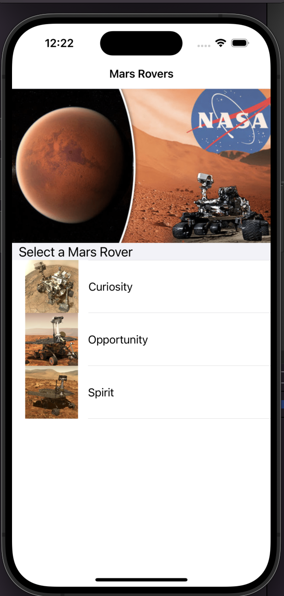
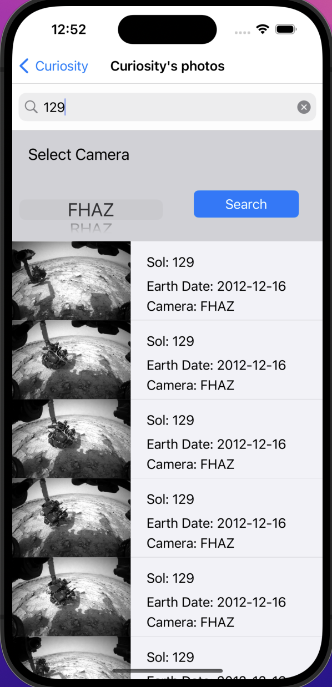
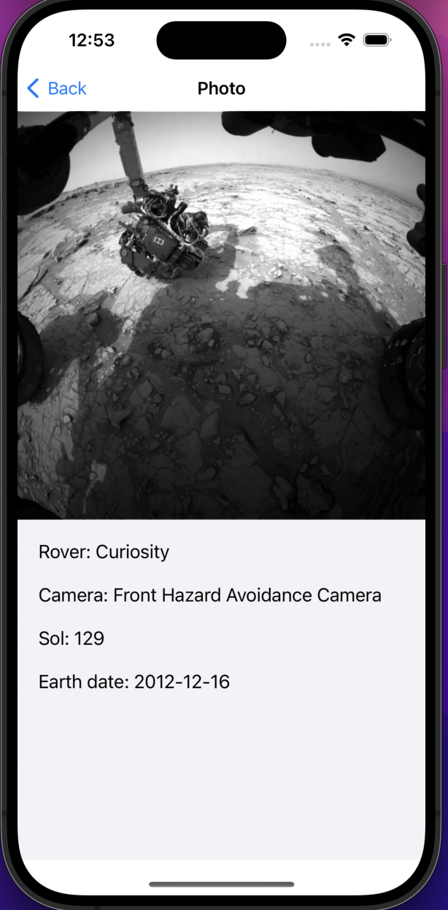
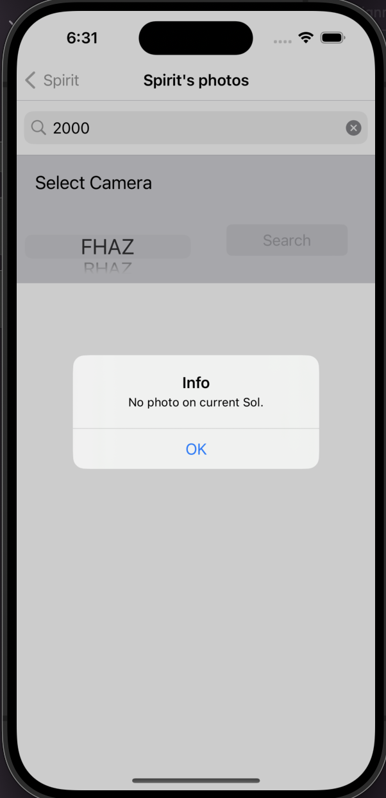

# ITE-5334-iOS-Assignment04

This is an iOS repo for assigment04

- [x] Build 1.00
- [x] Add Comments
- [x] Update Readme

- Features:
  - auto layout
  - custom table view
  - api request
  - load image
  - decode json
  - Activity Indicator

---

## API
  
- **Nasa Mars Rover**: https://github.com/corincerami/mars-photo-api
- **Rover mission info**: `/manifests/<rover_name>`
- **photo lists by rover name and sol**: `api.nasa.gov/mars-photos/api/v1/rovers/<rover_name>/photos?api_key=<api_key>&sol=<sol_day>&camera=<camera>`
  - `<rover_name>`: Curiosity, Opportunity, Spirit
  - `<api_key>`: key
  - `<camera>`: FHAZ(Front Hazard Avoidance Camera) / RHAZ(Rear Hazard Avoidance Camera)
  - `<sol_day>`: int

---

## Demo

- Demo Video:
  - https://www.youtube.com/watch?v=x24LYFmv6w8&t=2s

- Demo pic

- Alert when no photo on a sol

---

[TOP](#ite-5334-ios-assignment04)
